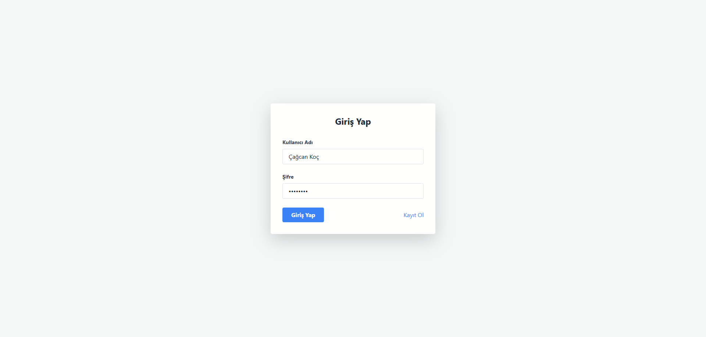
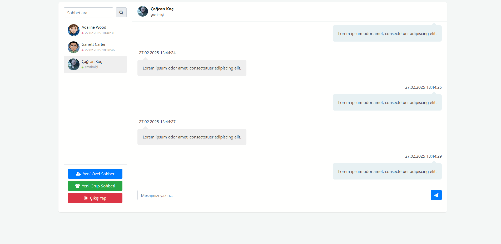
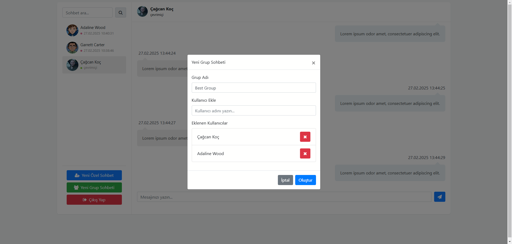
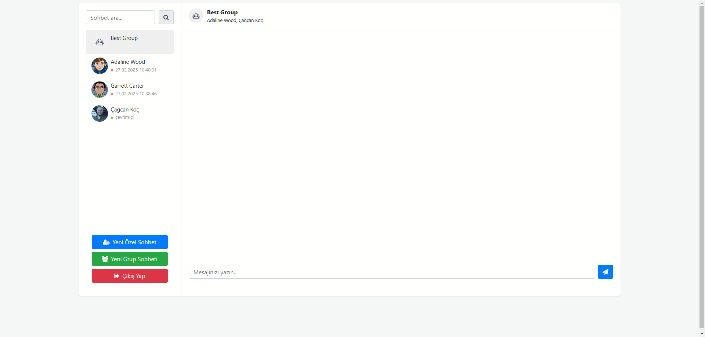
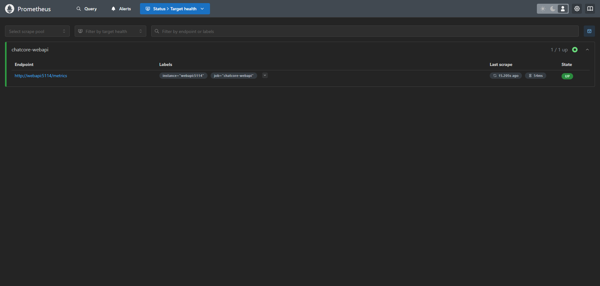
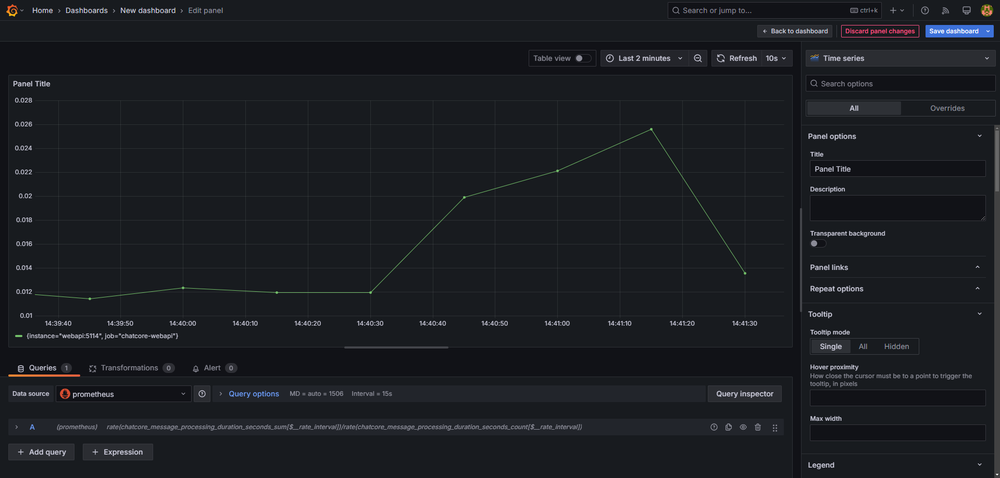

# ChatCore - Real-Time Chat Application

## Description

ChatCore is a real-time chat application developed using modern web technologies. The application provides a high-performance and scalable communication platform that supports both one-on-one and group chats.

### Key Features:
- 🔒 **Secure Authentication**: JWT-based secure session management
- 💬 **Instant Communication**: Real-time messaging with SignalR
- 👥 **Multiple Chat Support**: One-on-one and group chats
- 👀 **User Status**: Online/offline user tracking
- 📱 **Responsive Design**: User interface compatible with all devices
- ⚡ **High Performance**: Redis caching support
- 📊 **Detailed Monitoring**: System metrics tracking with Prometheus and Grafana

## Getting Started

### Prerequisites
- Docker Desktop

### Installation Steps

1. **Clone the repository**
```bash
git clone https://github.com/cagcankoc/ChatCore.git
cd ChatCore
```

2. **Set up environment variables**
```bash
cp .env.example .env
```

3. **Start the application**
```bash
docker-compose up
```

### 🔧 Service Access Points

| Service | URL | Credentials |
|---------|-----|-------------|
| 🌐 Frontend | `http://localhost:5173` | - |
| ⚙️ Backend API | `http://localhost:5114` | - |
| 📊 Prometheus | `http://localhost:9090` | - |
| 📈 Grafana | `http://localhost:3000` | Username: `admin`<br>Password: `admin` |

### 🏥 Health Check Points

| Service | Status | URL/Notes |
|---------|--------|-----------|
| API | 🟢 Active Monitoring | `http://localhost:5114/health` |
| SQL Server | 🔄 Internal Monitoring | Monitored by system |
| Redis | 🔄 Internal Monitoring | Monitored by system |

### 📊 Monitoring Dashboards

Visit `http://localhost:3000` to view Grafana dashboards:

- 📈 System Metrics
  - CPU and RAM usage
  - Network traffic
- 💬 Messaging Statistics
  - Real-time message count
  - User activity
- 🚦 Service Health
  - Uptime metrics
  - Error rates
- ⚡ Performance Indicators
  - Response times
  - System load

## Tech Stack

- **Backend**: .NET 8, Entity Framework Core, SignalR, AutoMapper, JWT
- **Database & Caching**: SQL Server 2022, Redis
- **Monitoring**: Prometheus, Grafana
- **Containerization**: Docker, Docker Compose
- **Frontend**: Vite + React, TypeScript

## Technical Architecture

### Backend Architecture
- Clean Architecture principles
- Entity Framework Core for data access
- SignalR for real-time communication
- Redis for distributed caching
- Comprehensive health checks

### Monitoring & Observability
- Prometheus metrics collection
- Grafana dashboards for visualization
- System and business metrics tracking
- Real-time performance monitoring
- Service health monitoring

### Security Architecture
- JWT token-based authentication
- HTTPS protocol support
- CORS policy configuration

### DevOps & Infrastructure
- Docker containerization
- Microservice architecture-ready
- Easy deployment with Docker Compose
- Scalable infrastructure design

## Project Structure

```
ChatCore/
├── docker-compose.yml                   # Docker compose configuration
├── prometheus.yml                       # Prometheus configuration
├── Server/                              # Backend services
│   └── ChatCore.WebApi/                 # Web API project
│       ├── Context/                     # Database context
│       ├── Controllers/                 # API controllers
│       ├── Dtos/                        # Data transfer objects
│           ├── ChatDtos/                # Chat related DTOs
│           ├── MessageDtos/             # Message related DTOs
│           └── UserDtos/                # User related DTOs
│       ├── Hubs/                        # SignalR hubs
│       ├── Interfaces/                  # Service interfaces
│       ├── Mapping/                     # AutoMapper configurations
│       ├── Migrations/                  # Database migrations
│       ├── Models/                      # Domain models
│       └── Dockerfile                   # Backend Docker config
│
└── Client/                              # Frontend application
    └── chatcore/                        # React application
        ├── src/                         # Source files
        │   ├── components/              # React components
        │   │   ├── ChatList.tsx         # Chat list component
        │   │   └── ChatWindow.tsx       # Chat window component
        │   ├── pages/                   # Page components
        │   │   ├── Chat.tsx             # Main chat page
        │   │   ├── Login.tsx            # Login page
        │   │   └── Register.tsx         # Registration page
        │   ├── services/                # API and service layers
        │   │   ├── api.ts               # API service
        │   │   └── signalR.ts           # SignalR service
        │   ├── stores/                  # State management
        │   │   ├── authStore.ts         # Authentication store
        │   │   └── chatStore.ts         # Chat state store
        │   └── App.tsx                  # Root component
        ├── public/                      # Public assets
        ├── Dockerfile                   # Frontend Docker config
        └── nginx.conf                   # Nginx configuration
```

## Images







